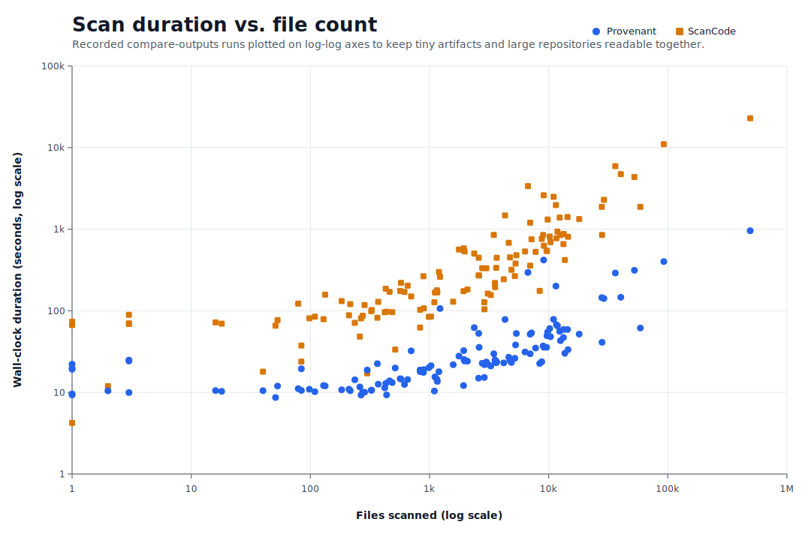

# Package Detection Benchmarks

> **Status**: 🟢 Canonical package-detection verification reference for recorded `compare-outputs` runs, timing snapshots, and notable Provenant-vs-ScanCode outcomes.
> **Canonical workflow**: [xtask/README.md](../xtask/README.md#compare-outputs)

This document records explicit `compare-outputs` runs with high-level timing metrics and notable end-state Provenant-vs-ScanCode outcomes on recorded targets.

## Scan duration vs. file count

The chart below uses a log-log scatter plot: file count on the x-axis, wall-clock duration in seconds on the y-axis, and both scanners on the same numeric axes. That keeps tiny artifact snapshots and very large repository scans readable in one view without flattening the smaller runs.

> Provenant is faster on 113 of 115 recorded runs, with a **10.8× median speedup** and **9.5× geometric-mean speedup** overall; the median gap grows from **3.7×** on sub-100-file targets to **16.2×** on 10k+ file targets.
> Generated from the benchmark timing rows in this document via `cargo run --manifest-path xtask/Cargo.toml --bin generate-benchmark-chart`.

## Current benchmark examples

The tables below provide the per-target detail behind the chart. Each row is one recorded `compare-outputs` run; the Run context column shows the benchmark date plus run ID suffix and machine information, and the Timing snapshot column shows same-host wall-clock timings with the relative result in **bold**.

### Repository-backed targets

#### Python / Conda / Pixi

| Target snapshot                                                                                                                                        | Run context                                                                                 | Timing snapshot                                                       | Advantages over ScanCode                                                                                                                                                                                                                                                                                                                                                                                                                                                                                                                    |
| ------------------------------------------------------------------------------------------------------------------------------------------------------ | ------------------------------------------------------------------------------------------- | --------------------------------------------------------------------- | ------------------------------------------------------------------------------------------------------------------------------------------------------------------------------------------------------------------------------------------------------------------------------------------------------------------------------------------------------------------------------------------------------------------------------------------------------------------------------------------------------------------------------------------- |
| [apache/airflow @ 47ce5f3](https://github.com/apache/airflow/tree/47ce5f32b4fae95f5865ba256d409c778d53a3d5) 11,854 files                            | 2026-04-11 · airflow-73385 · macOS 26.3.1 · Apple M1 Max · 32 GB · arm64 · 9 proc           | Provenant: 65.32s ScanCode: 936.34s **14.33× faster (-93.0%)**  | Far broader Python/provider package coverage (`142` vs `1`) and dependency extraction (`7579` vs `450`) from `uv.lock`, provider `pyproject.toml`, and committed `pnpm-lock.yaml` inputs, plus extra Docker and Helm package visibility, safer URL credential stripping, and cleaner copyright/author normalization across large documentation and kernel-style metadata blocks                                                                                                                                                             |
| [astropy/astropy @ 40280e3](https://github.com/astropy/astropy/tree/40280e3bd715a4968eda816c73bf88f05aa6cdc0) 1,970 files                           | 2026-04-19 · astropy-79216 · macOS 26.3.1 · Apple M1 Max · 32 GB · arm64 · 10 proc          | Provenant: 24.26s ScanCode: 534.66s **22.04× faster (-95.5%)**  | Direct `CITATION.cff` package visibility on the root citation metadata (`1` vs `0` on that file), plus far broader Python dependency extraction (`79` vs `1`) from `pyproject.toml` and `docs/rtd_environment.yaml`, with cleaner vendored holder recovery and Unicode-preserving copyright normalization                                                                                                                                                                                                                                   |
| [astral-sh/uv @ 9581f2b](https://github.com/astral-sh/uv/tree/9581f2b0ea65550a3efe28bd7aabde19d98b39ba) 1,225 files                                 | 2026-04-09 · uv-78243 · macOS 26.3.1 · Apple M1 Max · 32 GB · arm64 · 9 proc                | Provenant: 106.58s ScanCode: 261.33s **2.45× faster (-59.2%)**  | Far broader Python-family package and dependency extraction (`112` vs `1` packages, `4488` vs `759` dependencies) from the large `test/requirements/**` tree, many fixture/workspace `pyproject.toml` files, and multiple `uv.lock` inputs that ScanCode leaves at zero, with safer URL credential stripping, Unicode-preserving party normalization, and METADATA-backed wheel identity instead of double-counting a misleading filename                                                                                                   |
| [conda/conda @ 37549c4](https://github.com/conda/conda/tree/37549c41a1925b0625e346e2823a5e15af03b862) 285 files                                     | 2026-04-17 · conda-32831 · macOS 26.3.1 · Apple M1 Max · 32 GB · arm64 · 9 proc             | Provenant: 10.05s ScanCode: 117.64s **11.70× faster (-91.5%)**  | Broader Conda and Python package coverage (`5` vs `2` packages, `73` vs `26` dependencies) from `conda.recipe/meta.yaml`, multiple `environment.yml` fixtures, and the root `setup.py`, with safer URL credential stripping across authentication test fixtures                                                                                                                                                                                                                                                                             |
| [conda/conda-build @ 5da509d](https://github.com/conda/conda-build/tree/5da509d13764d96c02c80f24b54ab87d652b2538) 835 files                         | 2026-04-17 · conda-build-46648 · macOS 26.3.1 · Apple M1 Max · 32 GB · arm64 · 9 proc       | Provenant: 17.96s ScanCode: 102.91s **5.73× faster (-82.5%)**   | Far broader Conda recipe and dependency extraction (`257` vs `1` packages, `164` vs `13` dependencies) across committed `meta.yaml` recipe fixtures, split-package test recipes, and sidecar Python manifests, with explicit malformed-recipe scan errors on duplicate-key negative fixtures instead of silently treating them as ordinary package metadata                                                                                                                                                                                 |
| [conda-forge/pandas-feedstock @ 4063b72](https://github.com/conda-forge/pandas-feedstock/tree/4063b725cd252c02b0cebe935a8859a6b540fe00) 51 files    | 2026-04-17 · pandas-feedstock-44421 · macOS 26.3.1 · Apple M1 Max · 32 GB · arm64 · 9 proc  | Provenant: 8.66s ScanCode: 65.66s **7.59× faster (-86.8%)**     | Direct schema-versioned conda-forge feedstock package visibility (`1` vs `0` packages, `51` vs `0` dependencies) from `recipe/recipe.yaml`, plus assembled top-level Conda package identity and preserved source/about metadata                                                                                                                                                                                                                                                                                                             |
| [DefectDojo/django-DefectDojo @ 2f25c45](https://github.com/DefectDojo/django-DefectDojo/tree/2f25c4510361e2f27f63fbbcff3901cbd2ef4a07) 4,301 files | 2026-04-16 · django-DefectDojo-73011 · macOS 26.3.1 · Apple M1 Max · 32 GB · arm64 · 4 proc | Provenant: 78.26s ScanCode: 1473.92s **18.83× faster (-94.7%)** | Broader full-repo package and dependency extraction (`3` vs `2` packages, `616` vs `535` dependencies) from `.gitmodules`, `helm/defectdojo/Chart.yaml`, `helm/defectdojo/Chart.lock`, and the root `requirements*.txt` manifests, with direct Helm chart package visibility, pinned PostgreSQL or Valkey chart dependencies, Git-submodule package metadata, and zero scan errors where ScanCode reports 3 scan-file failures on large vulnerability fixtures                                                                              |
| [django/django @ 09f27cc](https://github.com/django/django/tree/09f27cc373eb1e6e5e8b286204809a79b61d55c3) 6,994 files                               | 2026-04-09 · django-66025 · macOS 26.3.1 · Apple M1 Max · 32 GB · arm64 · 9 proc            | Provenant: 29.74s ScanCode: 357.65s **12.03× faster (-91.7%)**  | Far broader Python-family package and dependency extraction (`2` vs `1` packages, `16` vs `6` dependencies) because `pyproject.toml` contributes both a real PyPI root package and 5 Python dependencies while `docs/requirements.txt` adds 5 more documentation dependencies that ScanCode leaves at zero, with clearer `BSD-3-Clause` declared-license capture and visibility into the vendored CVS marker that ScanCode skips                                                                                                            |
| [OpenMDAO/OpenMDAO @ bf1fcb6](https://github.com/OpenMDAO/OpenMDAO/tree/bf1fcb6f09a07a49cdba27c2fd765153ec54694c) 1,199 files                       | 2026-04-17 · OpenMDAO-49513 · macOS 26.3.1 · Apple M1 Max · 32 GB · arm64 · 9 proc          | Provenant: 17.94s ScanCode: 298.91s **16.66× faster (-94.0%)**  | Broader Pixi, Julia, and Docker package visibility (`3` vs `1` packages, `1489` vs `76` dependencies) from the root `pixi.toml`, resolved `pixi.lock`, and the experimental Julia `Project.toml`, with no `pixi.lock` scan errors where ScanCode times out and much richer lockfile license visibility                                                                                                                                                                                                                                      |
| [pandas-dev/pandas @ c385d01](https://github.com/pandas-dev/pandas/tree/c385d0188cbfb2294fb6362ec24b514b211c7fb1) 2,608 files                       | 2026-04-09 · pandas-97343 · macOS 26.3.1 · Apple M1 Max · 32 GB · arm64 · 9 proc            | Provenant: 35.66s ScanCode: 270.61s **7.59× faster (-86.8%)**   | Far broader Python/Conda/Pixi package and dependency extraction (`4` vs `1` packages, `3242` vs `251` dependencies) because `environment.yml` contributes a large resolved Conda environment, `pixi.toml` and current YAML `pixi.lock` surface an additional Pixi package graph, and `ci/meta.yaml` adds Conda recipe dependencies and package metadata beyond the root `pyproject.toml` package, while avoiding ScanCode's `pixi.lock` timeout and preserving clearer `BSD-3-Clause` declared-license capture on the Conda recipe metadata |
| [prefix-dev/pixi @ 6458b15](https://github.com/prefix-dev/pixi/tree/6458b15a855cf6beeaad1853ef007d9d20a5bccc) 2,372 files                           | 2026-04-17 · pixi-40465 · macOS 26.3.1 · Apple M1 Max · 32 GB · arm64 · 9 proc              | Provenant: 62.21s ScanCode: 503.12s **8.09× faster (-87.6%)**   | Broader Pixi package and dependency extraction (`223` vs `128` packages, `18016` vs `3116` dependencies) from the root and example `pixi.toml` or `pixi.lock` surfaces plus feature-scoped `pypi-dependencies`, with no example-lock scan errors where ScanCode times out and safer credential stripping or git URL normalization across Pixi source fixtures                                                                                                                                                                               |
| [pydata/xarray @ f7e47a1](https://github.com/pydata/xarray/tree/f7e47a19726321e56d74bca896eb55c6f330506b) 429 files                                 | 2026-04-17 · xarray-47801 · macOS 26.3.1 · Apple M1 Max · 32 GB · arm64 · 9 proc            | Provenant: 12.89s ScanCode: 186.62s **14.48× faster (-93.1%)**  | Broader Pixi and Conda environment coverage (`3` vs `1` packages, `509` vs `84` dependencies) from the repo-root `pixi.toml` plus committed Binder and CI environment manifests, with direct Pixi package identity and cleaner URL normalization across docs and SVG metadata                                                                                                                                                                                                                                                               |
| [python-poetry/poetry @ bfce511](https://github.com/python-poetry/poetry/tree/bfce5118814fa95445e823cb07a59bd77ffe1474) 987 files                   | 2026-04-12 · poetry-19769 · macOS 26.3.1 · Apple M1 Max · 32 GB · arm64 · 9 proc            | Provenant: 20.09s ScanCode: 84.36s **4.20× faster (-76.2%)**    | Far broader Python package and dependency extraction (`124` vs `16` packages, `531` vs `91` dependencies) from the root PEP 621 `pyproject.toml`, Poetry dependency groups, committed `poetry.lock` fixtures, and bundled wheel/sdist metadata, plus safer URL credential stripping and Unicode-preserving party normalization across repository docs and test fixtures                                                                                                                                                                     |
| [scipy/scipy @ 8a4633f](https://github.com/scipy/scipy/tree/8a4633fa0e01d62e9ccdd06ebe5bb30551cfa056) 2,998 files                                   | 2026-04-09 · scipy-49903 · macOS 26.3.1 · Apple M1 Max · 32 GB · arm64 · 9 proc             | Provenant: 23.57s ScanCode: 332.23s **14.10× faster (-92.9%)**  | Far broader Python/Conda/Pixi package and dependency extraction (`4` vs `1` packages, `1469` vs `78` dependencies) from `pixi.lock`'s large resolved Conda graph, `environment.yml`, `pixi.toml`, and the aggregated `requirements/*.txt` tree that ScanCode leaves at zero, with cleaner `pyproject.toml` requirement shaping for exact pins and environment markers                                                                                                                                                                       |

#### R / CRAN

| Target snapshot                                                                                                                  | Run context                                                                        | Timing snapshot                                                      | Advantages over ScanCode                                                                                                                                                                                                                                                       |
| -------------------------------------------------------------------------------------------------------------------------------- | ---------------------------------------------------------------------------------- | -------------------------------------------------------------------- | ------------------------------------------------------------------------------------------------------------------------------------------------------------------------------------------------------------------------------------------------------------------------------ |
| [tidyverse/dplyr @ 2f9f49e](https://github.com/tidyverse/dplyr/tree/2f9f49ef0d361dc612abc55982d68db3fb3854d0) 462 files       | 2026-04-19 · dplyr-11874 · macOS 26.3.1 · Apple M1 Max · 32 GB · arm64 · 4 proc    | Provenant: 13.86s ScanCode: 170.71s **12.32× faster (-91.9%)** | Direct CRAN package visibility on the root `DESCRIPTION` plus declared dependency extraction (`29` vs `0`) across `Depends`, `Imports`, `Suggests`, `Enhances`, and `LinkingTo`, with cleaner Rd or markdown URL normalization and preserved shipped license-holder metadata   |
| [r-lib/devtools @ a3447b9](https://github.com/r-lib/devtools/tree/a3447b9f3d59abb6cc8b63a54db3435819324c1e) 266 files         | 2026-04-19 · devtools-24729 · macOS 26.3.1 · Apple M1 Max · 32 GB · arm64 · 4 proc | Provenant: 9.28s ScanCode: 80.85s **8.71× faster (-88.5%)**    | Far broader CRAN package and dependency extraction (`14` vs `1` packages, `45` vs `1` dependencies) from the root `DESCRIPTION` plus committed test-package fixtures, with correct filtering of fake `pkg:cran/R` dependency noise and cleaner maintainer or URL normalization |
| [tidyverse/ggplot2 @ 7d79c95](https://github.com/tidyverse/ggplot2/tree/7d79c956b5707cb7c762d834caf842dc6496b032) 1,154 files | 2026-04-19 · ggplot2-95481 · macOS 26.3.1 · Apple M1 Max · 32 GB · arm64 · 4 proc  | Provenant: 14.46s ScanCode: 178.35s **12.33× faster (-91.9%)** | Direct CRAN package visibility on the root `DESCRIPTION` plus declared dependency extraction (`41` vs `0`) across `Imports`, `Suggests`, and `Enhances`, with correct hyphenated CRAN version constraints such as `sf (>= 0.7-3)` and cleaner Rd or roxygen URL recovery       |

#### JavaScript / TypeScript / web stacks

| Target snapshot                                                                                                                         | Run context                                                                           | Timing snapshot                                                        | Advantages over ScanCode                                                                                                                                                                                                                                                                                                                                        |
| --------------------------------------------------------------------------------------------------------------------------------------- | ------------------------------------------------------------------------------------- | ---------------------------------------------------------------------- | --------------------------------------------------------------------------------------------------------------------------------------------------------------------------------------------------------------------------------------------------------------------------------------------------------------------------------------------------------------- |
| [appsmithorg/appsmith @ 6ca79d1](https://github.com/appsmithorg/appsmith/tree/6ca79d1de1fa63ead9bcaed2d7509b309aa6825b) 13,366 files | 2026-04-15 · appsmith-9362 · macOS 26.3.1 · Apple M1 Max · 32 GB · arm64 · 9 proc     | Provenant: 59.00s ScanCode: 872.68s **14.79× faster (-93.2%)**   | Direct Helm chart package visibility on `deploy/helm/Chart.yaml` (`1` vs `0`) with declared dependency extraction (`4` vs `0`) for the pinned MongoDB, PostgreSQL, Prometheus, and Redis chart inputs that ScanCode leaves unmodeled                                                                                                                            |
| [baserow/baserow @ 18a5fc1](https://github.com/baserow/baserow/tree/18a5fc1fbf60666dc2509872efee5e8fa6ff750f) 8,755 files            | 2026-04-15 · baserow-6966 · macOS 26.3.1 · Apple M1 Max · 32 GB · arm64 · 9 proc      | Provenant: 23.76s ScanCode: 761.82s **32.06× faster (-96.9%)**   | Direct Helm package visibility on `deploy/helm/baserow/Chart.yaml` and `Chart.lock` (`2` file-level Helm surfaces vs `0`), with declared plus locked dependency extraction (`12` vs `0` on each chart file) covering sibling `baserow-common` aliases and the pinned Bitnami/Caddy chart inputs that ScanCode leaves at zero                                    |
| [getsentry/self-hosted @ 8728919](https://github.com/getsentry/self-hosted/tree/8728919e080836c53724f277d4d36cc310fc5011) 129 files  | 2026-04-15 · self-hosted-22209 · macOS 26.3.1 · Apple M1 Max · 32 GB · arm64 · 9 proc | Provenant: 12.14s ScanCode: 78.89s **6.50× faster (-84.6%)**     | Broader mixed Docker/npm/Python package extraction (`2` vs `1` packages, `111` vs `0` dependencies) from the integration-test `package-lock.json`, `uv.lock`, and committed service Dockerfiles, plus the more specific `Apache-2.0 AND FSL-1.1-ALv2` license classification on `LICENSE.md` where ScanCode reports only `FSL-1.1-ALv2`                         |
| [iTowns/itowns @ 08e08f5](https://github.com/iTowns/itowns/tree/08e08f512983b6f3d60d04d431b67b3c5e2e1584) 616 files                  | 2026-04-19 · itowns-87752 · macOS 26.3.1 · Apple M1 Max · 32 GB · arm64 · 10 proc     | Provenant: 12.53s ScanCode: 170.19s **13.58× faster (-92.6%)**   | Direct `publiccode.yml` package visibility on the root metadata file (`1` vs `0` on that file), with matched top-level package and dependency counts elsewhere plus Unicode-preserving Potree copyright normalization and cleaner URL shaping across README and docs material                                                                                   |
| [metabase/metabase @ 10997b1](https://github.com/metabase/metabase/tree/10997b10908414ab05773b085a56a37fcdebcd1a) 18,030 files       | 2026-04-13 · metabase-21346 · macOS 26.3.1 · Apple M1 Max · 32 GB · arm64 · 9 proc    | Provenant: 51.84s ScanCode: 1330.92s **25.67× faster (-96.1%)**  | Broader package and dependency extraction (`8` vs `1` packages, `1436` vs `423` dependencies) from the root and driver `deps.edn` manifests plus committed `bun.lock` and `uv.lock`, with cleaner OFL font URL normalization where ScanCode preserves broken concatenated links                                                                                 |
| [microsoft/vscode @ 0c1e100](https://github.com/microsoft/vscode/tree/0c1e100626c19724d1222c2bc4b63ba3556858a7) 14,398 files         | 2026-04-12 · vscode-89240 · macOS 26.3.1 · Apple M1 Max · 32 GB · arm64 · 9 proc      | Provenant: 58.96s ScanCode: 1410.57s **23.92× faster (-95.8%)**  | Broader monorepo package and dependency extraction (`138` vs `1` packages, `7718` vs `1815` dependencies) from the root `package-lock.json`, many extension fixture manifests and lockfiles, and embedded Cargo/Docker metadata, plus richer named package identities where ScanCode emits generic lockfile and archive rows                                    |
| [npm/cli @ 05dbba5](https://github.com/npm/cli/tree/05dbba5b8d727ddb2c098ce0553714eae791c5f2) 6,698 files                            | 2026-04-09 · cli-89026 · macOS 26.3.1 · Apple M1 Max · 32 GB · arm64 · 4 proc         | Provenant: 295.10s ScanCode: 3376.85s **11.44× faster (-91.3%)** | Clean root npm workspace manifest coverage without ScanCode's workspace-assembly scan errors, fewer large registry-fixture JSON timeouts, and cleaner handling of duplicated private-workspace dependency exports and repeated MIT-style registry-fixture metadata noise                                                                                        |
| [oven-sh/bun @ 700fc11](https://github.com/oven-sh/bun/tree/700fc117a2fd01ac0201deaa6fa69c5557acb04f) 12,551 files                   | 2026-04-09 · bun-18972 · macOS 26.3.1 · Apple M1 Max · 32 GB · arm64 · 9 proc         | Provenant: 43.05s ScanCode: 849.10s **19.72× faster (-94.9%)**   | Far broader Bun/npm-family package extraction (`382` vs `29` packages, `5773` vs `323` dependencies) from the repo's 52 committed `bun.lock` / `bun.lockb` inputs that ScanCode leaves at zero, plus legacy `bun.lockb` coverage on `bench/bundle` and plainer `BSD-2-Clause` rebucketing where ScanCode uses the over-specific `BSD-2-Clause-Views` label      |
| [renovatebot/renovate @ 91a7213](https://github.com/renovatebot/renovate/tree/91a72131e8aefcda8f0dab7499f378f7eb41300f) 3,663 files  | 2026-04-13 · renovate-30308 · macOS 26.3.1 · Apple M1 Max · 32 GB · arm64 · 9 proc    | Provenant: 23.74s ScanCode: 446.79s **18.82× faster (-94.7%)**   | Broader fixture-heavy package and dependency extraction (`52` vs `1` packages, `1778` vs `1485` dependencies) from committed `project.clj`, `deps.edn`, and cross-ecosystem manager fixtures, plus Leiningen package identity on `lib/modules/manager/leiningen/__fixtures__/project.clj` where ScanCode stays manifest-blind                                   |
| [vercel/next.js @ 8e5a36f](https://github.com/vercel/next.js/tree/8e5a36f6347528d8968da97262f372f908897bac) 28,044 files             | 2026-04-11 · next.js-35897 · macOS 26.3.1 · Apple M1 Max · 32 GB · arm64 · 9 proc     | Provenant: 41.11s ScanCode: 850.20s **20.68× faster (-95.2%)**   | Broader monorepo package and dependency extraction (`464` vs `249` packages, `13787` vs `12017` dependencies) from the root `pnpm-lock.yaml`, many workspace fixture subtrees, and embedded Cargo/npm metadata, plus zero scan errors where ScanCode crashes on workspace `package.json` and `pnpm-lock.yaml` inputs                                            |
| [yarnpkg/berry @ c0274d6](https://github.com/yarnpkg/berry/tree/c0274d6d7ba5939f447e78aaf16e456a00cf0bd1) 3,552 files                | 2026-04-12 · berry-43600 · macOS 26.3.1 · Apple M1 Max · 32 GB · arm64 · 9 proc       | Provenant: 23.75s ScanCode: 194.82s **8.20× faster (-87.8%)**    | Broader dependency extraction (`2835` vs `1301`) from Berry `yarn.lock`, workspace manifests, and `.pnp.cjs`, plus cleaner workspace package assembly that avoids ScanCode's duplicated npm package rows (`204` vs `395`) and `package.json` / `yarn.lock` assembly crashes while still surfacing extra Docker and Windows package inputs committed in the tree |

#### JVM / Java / Scala / Clojure

| Target snapshot                                                                                                                                       | Run context                                                                             | Timing snapshot                                                        | Advantages over ScanCode                                                                                                                                                                                                                                                                                                                                                                                                          |
| ----------------------------------------------------------------------------------------------------------------------------------------------------- | --------------------------------------------------------------------------------------- | ---------------------------------------------------------------------- | --------------------------------------------------------------------------------------------------------------------------------------------------------------------------------------------------------------------------------------------------------------------------------------------------------------------------------------------------------------------------------------------------------------------------------- |
| [akka/akka @ 5ace141](https://github.com/akka/akka/tree/5ace141e1c80a9f832430ee3ab7ff4fb3b581c40) 4,623 files                                      | 2026-04-17 · akka-24789 · macOS 26.3.1 · Apple M1 Max · 32 GB · arm64 · 9 proc          | Provenant: 26.97s ScanCode: 681.19s **25.26× faster (-96.0%)**   | Matched top-level SBT package coverage (`7` vs `7`) with broader dependency extraction (`49` vs `40`) from the root `build.sbt`, sample applications, and native-image test manifests, plus cleaner rejection of weak actor-name author noise such as `the ActorSystem` and `the ReceiveBuilder`                                                                                                                                  |
| [apache/felix-dev @ 20aee77](https://github.com/apache/felix-dev/tree/20aee77cce8cad21493368403701d9c44c168f62) 5,354 files                        | 2026-04-12 · felix-dev-25577 · macOS 26.3.1 · Apple M1 Max · 32 GB · arm64 · 9 proc     | Provenant: 52.75s ScanCode: 479.56s **9.09× faster (-89.0%)**    | Matched Maven/OSGi package coverage (`196` vs `196`) with richer dependency extraction (`995` vs `962`) from classifier/type-aware Maven coordinates, OSGi integration-test POMs, and committed JAR or `MANIFEST.MF` metadata                                                                                                                                                                                                     |
| [apache/kafka @ 0d9fe51](https://github.com/apache/kafka/tree/0d9fe518b616725fecd96162297fee89a7b7a6a5) 7,179 files                                | 2026-04-13 · kafka-86697 · macOS 26.3.1 · Apple M1 Max · 32 GB · arm64 · 9 proc         | Provenant: 53.61s ScanCode: 751.77s **14.02× faster (-92.9%)**   | Far broader Gradle and sidecar Python package extraction (`6` vs `4` packages, `662` vs `15` dependencies) from the root multi-project `build.gradle`, Kafka module wiring, and the committed `tests/setup.py`, plus extra Docker package visibility on the bundled image fixtures                                                                                                                                                |
| [apache/maven @ 459de76](https://github.com/apache/maven/tree/459de765537854376dd499e931ab87e1d53f9c23) 9,688 files                                | 2026-04-12 · maven-54443 · macOS 26.3.1 · Apple M1 Max · 32 GB · arm64 · 9 proc         | Provenant: 49.40s ScanCode: 540.33s **10.94× faster (-90.9%)**   | Near-aligned Maven package coverage (`2516` vs `2518`) with much richer dependency extraction (`5032` vs `2267`) from parent/module inheritance, `dependencyManagement`, and committed `.pom` fixtures, plus more specific classifier-bearing Maven identities where ScanCode flattens coordinates and quieter unresolved-placeholder handling that preserves Maven semantics without flooding the scan with property/cycle noise |
| [elastic/elasticsearch @ a414f3d](https://github.com/elastic/elasticsearch/tree/a414f3d06c7ab59a5a0b350e80e5674bf9864688) 40,293 files             | 2026-04-13 · elasticsearch-29514 · macOS 26.3.1 · Apple M1 Max · 32 GB · arm64 · 9 proc | Provenant: 146.56s ScanCode: 4726.52s **32.25× faster (-96.9%)** | Matched top-level package coverage (`1` vs `1`) with richer dependency extraction (`2378` vs `2067`) from the large multi-project Gradle build graph, plus extra Docker package visibility on committed fixture and distribution Dockerfiles                                                                                                                                                                                      |
| [gradle/gradle @ 92068b4](https://github.com/gradle/gradle/tree/92068b4fd4e6f3689b5164d9bf7f3b7c97bc4f4e) 27,912 files                             | 2026-04-13 · gradle-13823 · macOS 26.3.1 · Apple M1 Max · 32 GB · arm64 · 9 proc        | Provenant: 145.05s ScanCode: 1879.67s **12.96× faster (-92.3%)** | Broader Gradle package and dependency extraction (`73` vs `68` packages, `1675` vs `1541` dependencies) from committed `build.gradle`, `build.gradle.kts`, `gradle.lockfile`, and `.module` metadata across docs and test fixtures                                                                                                                                                                                                |
| [playframework/playframework @ c2c114f](https://github.com/playframework/playframework/tree/c2c114ff31eff1557bef65cc3f586fbc53c974a6) 2,579 files  | 2026-04-17 · playframework-15041 · macOS 26.3.1 · Apple M1 Max · 32 GB · arm64 · 9 proc | Provenant: 14.94s ScanCode: 272.30s **18.23× faster (-94.5%)**   | Broader SBT dependency extraction (`7` vs `3`) and file-level SBT package visibility across the root build and committed `play-sbt-plugin` fixture projects, plus correct no-year copyright and holder recovery on vendored jQuery banners that ScanCode-only parity previously exposed                                                                                                                                           |
| [scalatest/scalatest @ f6ba8f2](https://github.com/scalatest/scalatest/tree/f6ba8f25999f240831362cd7498ba5beee7dc375) 1,935 files                  | 2026-04-17 · scalatest-15059 · macOS 26.3.1 · Apple M1 Max · 32 GB · arm64 · 9 proc     | Provenant: 32.53s ScanCode: 582.97s **17.92× faster (-94.4%)**   | Broader file-level SBT package visibility on `build.sbt` and `project/build.sbt`, with declared dependency extraction from `project/build.sbt` and correct copyright recovery from XML-attribute notices in the legacy `build.xml` ant workflow                                                                                                                                                                                   |
| [spring-projects/spring-boot @ 53827d4](https://github.com/spring-projects/spring-boot/tree/53827d47d0802670fd53b665643aef8af4fe7bc8) 11,610 files | 2026-04-12 · spring-boot-37372 · macOS 26.3.1 · Apple M1 Max · 32 GB · arm64 · 9 proc   | Provenant: 67.58s ScanCode: 776.24s **11.49× faster (-91.3%)**   | Broader JVM monorepo package and dependency extraction (`173` vs `165` packages, `4434` vs `4233` dependencies) from nested Maven example POMs, the committed Antora `package-lock.json`, and Docker/WAR metadata, plus more specific SBOM license expressions where ScanCode flattens `EPL-2.0 AND Classpath-exception-2.0` or `BSD-2-Clause-Views AND BSD-3-Clause`                                                             |
| [technomancy/leiningen @ 4022732](https://github.com/technomancy/leiningen/tree/40227328d4a9c8945362d6d626d19c2449175df6) 300 files                | 2026-04-12 · leiningen-2458 · macOS 26.3.1 · Apple M1 Max · 32 GB · arm64 · 9 proc      | Provenant: 18.81s ScanCode: 17.13s **1.10× slower (+9.8%)**      | Broader Clojure manifest and dependency extraction (`82` vs `10` dependencies) from the root, nested checkout, and test-project `project.clj` surfaces that ScanCode leaves at manifest-only visibility, plus OFL font-license recovery and cleaner URL normalization where ScanCode preserves regex suffixes, trailing-slash drift, or percent-encoded placeholder text                                                          |

#### Rust / Go / native / infrastructure

| Target snapshot                                                                                                                                            | Run context                                                                                                                 | Timing snapshot                                                         | Advantages over ScanCode                                                                                                                                                                                                                                                                                                                                                                                                                           |
| ---------------------------------------------------------------------------------------------------------------------------------------------------------- | --------------------------------------------------------------------------------------------------------------------------- | ----------------------------------------------------------------------- | -------------------------------------------------------------------------------------------------------------------------------------------------------------------------------------------------------------------------------------------------------------------------------------------------------------------------------------------------------------------------------------------------------------------------------------------------- |
| [bazelbuild/bazel @ eb5aeaa](https://github.com/bazelbuild/bazel/tree/eb5aeaaa23d52601a2aca11ff6fd1a74ea97f0d6) 11,496 files                            | 2026-04-20 · bazel-76264 · macOS 26.3.1 · Apple M1 Max · 32 GB · arm64 · 9 proc                                             | Provenant: 200.80s ScanCode: 1974.56s **9.83× faster (-89.8%)**   | Broader Bazel package and dependency extraction (`1729` vs `1711` packages, `79` vs `14` dependencies) from root and nested `BUILD` files plus direct `MODULE.bazel` dependency visibility, with richer Debian and RPM sidecar package metadata                                                                                                                                                                                                    |
| [boostorg/boost @ 4f1cbeb](https://github.com/boostorg/boost/tree/4f1cbeb724d9f3c08a826fbcee5a3db2f5480441) 236 files                                   | 2026-04-10 · boost-67106 · macOS 26.3.1 · Apple M1 Max · 32 GB · arm64 · 9 proc                                             | Provenant: 14.29s ScanCode: 71.17s **4.98× faster (-79.9%)**      | Cleaner XML author extraction without ScanCode's prose-tainted suffixes such as `A.Meredith Compiler`, while still recovering real names like `Jeremy Siek` and `David Goodger` that ScanCode misses                                                                                                                                                                                                                                               |
| [boostorg/json @ 70efd4b](https://github.com/boostorg/json/tree/70efd4b032b7f3e718bb4ca4ae144c3171b21568) 701 files                                     | 2026-04-10 · json-80796 · macOS 26.3.1 · Apple M1 Max · 32 GB · arm64 · 9 proc                                              | Provenant: 32.30s ScanCode: 150.19s **4.65× faster (-78.5%)**     | Cleaner GSoC participant-name extraction in `bench/data/gsoc-2018.json`, preserving real names like `Adrián Bazaga` instead of ScanCode's `type' Person name' ...` noise, plus more complete placeholder URL closure on templated GitHub API routes                                                                                                                                                                                                |
| [chromium/chromium @ 2befda7](https://github.com/chromium/chromium/tree/2befda78fcc7fa5649540420eedcdd87a2583fe0) 491,354 files                         | 2026-04-14 · chromium-2befda78fcc7fa5649540420eedcdd87a2583fe0-98082 · macOS 26.3.1 · Apple M1 Max · 32 GB · arm64 · 9 proc | Provenant: 957.91s ScanCode: 22892.20s **23.90× faster (-95.8%)** | Broader dependency extraction (`16620` vs `12378`) from three tracked `.gitmodules` manifests plus vendored package surfaces, richer package coverage (`1310` vs `1279`), matched `README.chromium` package visibility across 940 vendored README files (`927` package records each), direct Git-submodule visibility where ScanCode reports zero package data on those `.gitmodules`, and fewer scan errors (`1` vs `4`) under the shared profile |
| [containerd/containerd @ 83044a43](https://github.com/containerd/containerd/tree/83044a43a1032ea53ceca6d2d11018d7c103f9de) 6,332 files                  | 2026-04-12 · containerd-98515 · macOS 26.3.1 · Apple M1 Max · 32 GB · arm64 · 9 proc                                        | Provenant: 31.31s ScanCode: 533.84s **17.05× faster (-94.1%)**    | Matched Go package coverage (`2` vs `2`) with slightly richer dependency extraction (`652` vs `651`) from vendored `mkdocs-reqs.txt` and committed Python sidecar requirements, while keeping Go module inventory aligned on the root `go.mod` and `go.sum` surfaces                                                                                                                                                                               |
| [curl/curl @ 40d57c9](https://github.com/curl/curl/tree/40d57c9f588c42ed3f75fe0ba9b12aa18170a404) 4,195 files                                           | 2026-04-13 · curl-24435 · macOS 26.3.1 · Apple M1 Max · 32 GB · arm64 · 9 proc                                              | Provenant: 23.00s ScanCode: 243.12s **10.57× faster (-90.5%)**    | Matched ScanCode's file-level Autotools `configure.ac` coverage while promoting one top-level Autotools package (`1` vs `0`), with the real `pkg:autotools/curl` identity instead of a generic input placeholder, plus extra Docker package and dependency visibility from the committed `Dockerfile`                                                                                                                                              |
| [Debian/apt @ 6b12812](https://github.com/Debian/apt/tree/6b128124271e94bdb0f4e7850d9286170d712b04) 889 files                                           | 2026-04-15 · apt-31610 · macOS 26.3.1 · Apple M1 Max · 32 GB · arm64 · 9 proc                                               | Provenant: 17.56s ScanCode: 265.28s **15.11× faster (-93.4%)**    | Matched Debian source-package coverage (`7` vs `7`) with broader dependency extraction (`32` vs `0`) from the root multi-binary `debian/control` Build-Depends plus runtime relation fields such as `Depends`, `Recommends`, `Suggests`, `Breaks`, `Conflicts`, and `Provides`                                                                                                                                                                     |
| [docker-library/official-images @ 71567fb](https://github.com/docker-library/official-images/tree/71567fbcfa7945774c08c32c04f67ef34c9bce82) 365 files   | 2026-04-15 · official-images-26463 · macOS 26.3.1 · Apple M1 Max · 32 GB · arm64 · 9 proc                                   | Provenant: 22.49s ScanCode: 82.24s **3.66× faster (-72.7%)**      | Matched top-level package coverage (`1` vs `1`) with broader dependency extraction (`9` vs `2`) from the repo-root `Dockerfile` and committed Ruby test `Gemfile`s, plus Docker-library `Maintainers` author recovery across `library/*` definitions with cleaner Unicode-preserving normalization and `GitRepo` trailers left out of author values                                                                                                |
| [docker-library/python @ ced4ac7](https://github.com/docker-library/python/tree/ced4ac7ca9f8f8bdbb113f06fe02c42895875aa4) 53 files                      | 2026-04-15 · python-26464 · macOS 26.3.1 · Apple M1 Max · 32 GB · arm64 · 9 proc                                            | Provenant: 11.96s ScanCode: 76.81s **6.42× faster (-84.4%)**      | Broader Docker package visibility across 42 generated image Dockerfiles where ScanCode reports none, plus maintainer-line author recovery on `generate-stackbrew-library.sh`, with exact top-level package, dependency, and license parity elsewhere                                                                                                                                                                                               |
| [facebook/buck2 @ 3359f75](https://github.com/facebook/buck2/tree/3359f75abe3c7b6f543fdb2c7a775d47347b8897) 9,600 files                                 | 2026-04-14 · buck2-86132 · macOS 26.3.1 · Apple M1 Max · 32 GB · arm64 · 9 proc                                             | Provenant: 35.72s ScanCode: 545.33s **15.27× faster (-93.4%)**    | Slightly richer mixed-repository dependency extraction (`7079` vs `7034`) from committed `yarn.lock`, `flake.nix` / `flake.lock`, and Conan fixtures, plus zero scan errors where ScanCode still trips on `prelude/third-party/hmaptool/METADATA.bzl` and richer Buck target visibility on multi-rule `BUCK` files                                                                                                                                 |
| [facebook/watchman @ 426a7b7](https://github.com/facebook/watchman/tree/426a7b7dbd8600e1f3f9a33fd6715bb08295ca1a) 896 files                             | 2026-04-14 · watchman-2713 · macOS 26.3.1 · Apple M1 Max · 32 GB · arm64 · 9 proc                                           | Provenant: 19.03s ScanCode: 107.21s **5.63× faster (-82.2%)**     | Richer Buck target visibility on `watchman/BUCK` and `watchman/fs/BUCK` (`43` and `4` file-level Buck package records where ScanCode reports none), plus extra Docker and Gemfile package visibility, with matched zero-scan-error output                                                                                                                                                                                                          |
| [ffmpeg/ffmpeg @ 056562a](https://github.com/ffmpeg/ffmpeg/tree/056562a5ff64e79ad40b141ded3f644811e812f6) 10,200 files                                  | 2026-04-09 · ffmpeg-66392 · macOS 26.3.1 · Apple M1 Max · 32 GB · arm64 · 9 proc                                            | Provenant: 60.60s ScanCode: 812.80s **13.41× faster (-92.5%)**    | Matched ScanCode's file-level Autotools `configure` package identity while also promoting one top-level Autotools package (`1` vs `0`), plus cleaner rejection of weak `configure` variable-name and bare-word GPL noise such as `EXTERNAL_LIBRARY_GPL_LIST` and `LICENSE_LIST="gpl"`                                                                                                                                                              |
| [git/git @ 9f223ef](https://github.com/git/git/tree/9f223ef1c026d91c7ac68cc0211bde255dda6199) 4,734 files                                               | 2026-04-14 · git-93498 · macOS 26.3.1 · Apple M1 Max · 32 GB · arm64 · 9 proc                                               | Provenant: 24.70s ScanCode: 452.09s **18.30× faster (-94.5%)**    | Broader package-adjacent Git metadata visibility on the tracked `.gitmodules` manifest (`1` vs `0` dependencies on that file), plus one extra top-level package row (`4` vs `3`) from treating the manifest as package metadata instead of leaving it scanner-silent                                                                                                                                                                               |
| [go-gitea/gitea @ 47fdf3e2](https://github.com/go-gitea/gitea/tree/47fdf3e284308c6b648936b5c15e136b08f5e1da) 5,201 files                                | 2026-04-12 · gitea-13504 · macOS 26.3.1 · Apple M1 Max · 32 GB · arm64 · 9 proc                                             | Provenant: 26.21s ScanCode: 266.07s **10.15× faster (-90.1%)**    | Broader package and dependency extraction (`3` vs `2` packages, `1943` vs `1917` dependencies) from `flake.nix`, `flake.lock`, `Dockerfile`, and `uv.lock`, plus a correct root Go module identity on `go.mod` where ScanCode emits the malformed `pkg:golang/%28` package row                                                                                                                                                                     |
| [grpc/grpc @ f87c29f](https://github.com/grpc/grpc/tree/f87c29f069971d1356e5784005af499db52e7f31) 10,361 files                                          | 2026-04-14 · grpc-95301 · macOS 26.3.1 · Apple M1 Max · 32 GB · arm64 · 9 proc                                              | Provenant: 48.11s ScanCode: 694.17s **14.43× faster (-93.1%)**    | Far broader dependency extraction (`418` vs `92`) from the root `.gitmodules`, `MODULE.bazel`, and vendored package surfaces, richer package coverage (`782` vs `761`), and direct Git-submodule visibility on 17 tracked third-party submodules where ScanCode reports zero package data on the same manifest                                                                                                                                     |
| [guillemj/dpkg @ 0061122](https://github.com/guillemj/dpkg/tree/006112209ac937b373d4497c81998a415cbef0f5) 1,766 files                                   | 2026-04-15 · dpkg-14220 · macOS 26.3.1 · Apple M1 Max · 32 GB · arm64 · 9 proc                                              | Provenant: 27.87s ScanCode: 563.43s **20.22× faster (-95.1%)**    | Broader Debian source-package and dependency extraction (`23` vs `19` packages, `18` vs `0` dependencies) from the root multi-binary `debian/control` file plus committed `.dsc` fixtures, with explicit package visibility for `dpkg-dev`, `libdpkg-dev`, and `libdpkg-perl` and one extra top-level Autotools package on `configure.ac`                                                                                                          |
| [kubernetes/kubernetes @ d3b9c54](https://github.com/kubernetes/kubernetes/tree/d3b9c54bd952117924fb0790f6989c0d30715b19) 29,080 files                  | 2026-04-08 · kubernetes-36057 · macOS 26.3.1 · Apple M1 Max · 32 GB · arm64 · 9 proc                                        | Provenant: 141.58s ScanCode: 2291.67s **16.19× faster (-93.8%)**  | Broader Dockerfile and `go.work` package coverage, richer staging-workspace dependency extraction (`7187` vs `6950`), and richer `BSD-3-Clause AND Apache-2.0` compound license classification where ScanCode collapses many of the same files to plain `Apache-2.0`                                                                                                                                                                               |
| [libevent/libevent @ 4829651](https://github.com/libevent/libevent/tree/48296514d8fd9c0b3812b11d45ad80b0c002c14e) 260 files                             | 2026-04-13 · libevent-53312 · macOS 26.3.1 · Apple M1 Max · 32 GB · arm64 · 9 proc                                          | Provenant: 11.67s ScanCode: 48.32s **4.14× faster (-75.8%)**      | Matched ScanCode's file-level Autotools `configure.ac` coverage while promoting one top-level Autotools package (`1` vs `0`), with the real `pkg:autotools/libevent` identity instead of a generic input placeholder                                                                                                                                                                                                                               |
| [libgit2/libgit2 @ 1f34e2a](https://github.com/libgit2/libgit2/tree/1f34e2a57a3d03f174771203b64aed2b17e8522c) 8,406 files                               | 2026-04-13 · libgit2-55978 · macOS 26.3.1 · Apple M1 Max · 32 GB · arm64 · 9 proc                                           | Provenant: 22.61s ScanCode: 175.31s **7.75× faster (-87.1%)**     | Broader mixed-repository dependency extraction (`12` vs `0`) from committed `script/api-docs/package.json` and `script/api-docs/package-lock.json`, while keeping the top-level Autotools package aligned (`1` vs `1`)                                                                                                                                                                                                                             |
| [moby/moby @ 21bd660](https://github.com/moby/moby/tree/21bd660cd595929275d8f1361d224f663a2cfc44) 12,375 files                                          | 2026-04-15 · moby-96333 · macOS 26.3.1 · Apple M1 Max · 32 GB · arm64 · 9 proc                                              | Provenant: 56.00s ScanCode: 1388.49s **24.79× faster (-96.0%)**   | Matched top-level package coverage (`5` vs `5`) with slightly richer dependency extraction (`1093` vs `1088`) from relative Go module edges, vendored `.gitmodules`, and committed `requirements.txt`, plus extra Docker package visibility on committed Dockerfiles and cleaner rejection of weak prose-only author or holder matches such as `the Prometheus`                                                                                    |
| [mongodb/mongo @ d6877a3](https://github.com/mongodb/mongo/tree/d6877a33a90e253f4e7a9641a3eb237518a5a495) 52,443 files                                  | 2026-04-11 · mongo-94907 · macOS 26.3.1 · Apple M1 Max · 32 GB · arm64 · 9 proc                                             | Provenant: 313.61s ScanCode: 4363.53s **13.91× faster (-92.8%)**  | Broader package/dependency extraction (`40` vs `1` packages, `618` vs `7` dependencies) from vendored gRPC Bazel BUILD files plus `poetry.lock`, `pnpm-lock.yaml`, and RPM spec metadata, richer Debian namespace/PURL identity on package metadata, and cleaner SBOM author recovery with score-fusion code examples left as code data instead of people                                                                                          |
| [nmap/nmap @ d9199d7](https://github.com/nmap/nmap/tree/d9199d7cd5e99f54fc4b67d592a30fa597a94c40) 2,587 files                                           | 2026-04-08 · nmap-75671 · macOS 26.3.1 · Apple M1 Max · 32 GB · arm64 · 9 proc                                              | Provenant: 52.87s ScanCode: 447.07s **8.46× faster (-88.2%)**     | Broader package/dependency extraction (`18` vs `2` packages, `13` vs `2` dependencies), preserved NPSL/source-available handling across core Nmap and Zenmap reference-notice files, and cleaner rejection of weak translated-manpage GPL bare-word and placeholder noise                                                                                                                                                                          |
| [protocolbuffers/protobuf @ e3370c2](https://github.com/protocolbuffers/protobuf/tree/e3370c2e26bbfaa63bc9f8e4ac0f8dc066ba3eeb) 3,463 files             | 2026-04-19 · protobuf-25627 · macOS 26.3.1 · Apple M1 Max · 32 GB · arm64 · 9 proc                                          | Provenant: 29.73s ScanCode: 851.02s **28.62× faster (-96.5%)**    | Broader Bazel and cross-language dependency extraction (`551` vs `537` packages, `144` vs `64` dependencies) from root and example `MODULE.bazel`, many `BUILD` files, committed `*.csproj`, and Maven BOM imports, with direct Git-submodule package visibility on `.gitmodules`                                                                                                                                                                  |
| [rpm-software-management/dnf @ e47634f](https://github.com/rpm-software-management/dnf/tree/e47634fbe3565d0580e89ec21adb7c1b308642ce) 655 files         | 2026-04-19 · dnf-58187 · macOS 26.3.1 · Apple M1 Max · 32 GB · arm64 · 9 proc                                               | Provenant: 14.37s ScanCode: 203.47s **14.16× faster (-92.9%)**    | Broader RPM package and dependency extraction (`163` vs `138` packages, `579` vs `1` dependencies) from committed `.rpm` fixtures and sibling `.spec` metadata, with normalized RPM header license expressions and one-package-per-spec ownership across the shipped module fixture trees                                                                                                                                                          |
| [rpm-software-management/libdnf @ d395731](https://github.com/rpm-software-management/libdnf/tree/d39573195e24b43687587a8d83b9f6ac274e2412) 1,162 files | 2026-04-19 · libdnf-87966 · macOS 26.3.1 · Apple M1 Max · 32 GB · arm64 · 9 proc                                            | Provenant: 13.65s ScanCode: 168.27s **12.33× faster (-91.9%)**    | Broader RPM package and dependency extraction (`352` vs `327` packages, `1441` vs `0` dependencies) from committed `.rpm` fixture trees and sibling `.spec` metadata, with normalized RPM header license expressions and cleaner rejection of config or doc false positives such as `baseurl` and `doxygen. Using` as holder or author data                                                                                                        |
| [rust-lang/cargo @ b54fe55](https://github.com/rust-lang/cargo/tree/b54fe551a982d75d299e0d54daeac70cb854eef0) 2,883 files                               | 2026-04-13 · cargo-80909 · macOS 26.3.1 · Apple M1 Max · 32 GB · arm64 · 9 proc                                             | Provenant: 15.25s ScanCode: 127.38s **8.35× faster (-88.0%)**     | Matched Cargo package coverage (`552` vs `552`) with workspace-root package retention, legacy `dev_dependencies` / `build_dependencies` manifest coverage, and zero scan errors on malformed fixture manifests, plus extra Docker package visibility on committed test containers                                                                                                                                                                  |
| [rust-lang/rust @ dab8d9d](https://github.com/rust-lang/rust/tree/dab8d9d1066c4c95008163c7babf275106ce3f32) 58,818 files                                | 2026-04-12 · rust-99252 · macOS 26.3.1 · Apple M1 Max · 32 GB · arm64 · 9 proc                                              | Provenant: 61.49s ScanCode: 1879.48s **30.57× faster (-96.7%)**   | Near-aligned native-tree package and dependency extraction (`341` vs `344` packages, `5771` vs `5921` dependencies) with better nested Cargo lock dependency visibility across mixed workspaces, additional Nix package visibility, and more specific versioned Cargo package identities where ScanCode emits generic lockfile rows or versionless crate names                                                                                     |
| [tensorflow/tensorflow @ 2cd48d2](https://github.com/tensorflow/tensorflow/tree/2cd48d27d98b3fefd565f246f41bf93724f3f23c) 36,237 files                  | 2026-04-19 · tensorflow-35904 · macOS 26.3.1 · Apple M1 Max · 32 GB · arm64 · 9 proc                                        | Provenant: 290.44s ScanCode: 5927.08s **20.41× faster (-95.1%)**  | Broader Bazel and mixed-tree dependency extraction (`8202` vs `8056` packages, `1465` vs `700` dependencies) from root and vendored `MODULE.bazel`, many committed `BUILD` files, Python lockfiles, Dockerfiles, and Debian control metadata, plus direct `CITATION.cff` package visibility                                                                                                                                                        |
| [tokio-rs/tokio @ 5db10f5](https://github.com/tokio-rs/tokio/tree/5db10f538b683fe88d699dfd11be31d193db011c) 833 files                                   | 2026-04-13 · tokio-97089 · macOS 26.3.1 · Apple M1 Max · 32 GB · arm64 · 9 proc                                             | Provenant: 18.81s ScanCode: 62.23s **3.31× faster (-69.8%)**      | Matched Cargo workspace package and dependency coverage (`12` vs `12` packages, `83` vs `83` dependencies) while preserving collective manifest-author names like `Tokio Contributors <team@tokio.rs>`, plus cleaner rejection of ScanCode's weak `(c)`-plus-URL copyright and holder noise and normalized docs.rs URL variants                                                                                                                    |
| [torvalds/linux @ b42ed3b](https://github.com/torvalds/linux/tree/b42ed3bb884e6b399b46d19df3f5cf015a79c804) 92,523 files                                | 2026-04-10 · linux-31154 · macOS 26.3.1 · Apple M1 Max · 32 GB · arm64 · 9 proc                                             | Provenant: 401.15s ScanCode: 11017.99s **27.47× faster (-96.4%)** | Broader sparse-tree package visibility (`4` vs `2` packages, `20` vs `19` dependencies), plus cleaner common-profile author extraction on representative native-source docs such as `sysrq`, `cpusets`, and `hwmon` rosters while rejecting several ScanCode-only prose false positives like `the Coreboot BIOS.` and `the Host`                                                                                                                   |

#### Apple / Swift / Flutter / mobile

| Target snapshot                                                                                                                                | Run context                                                                                             | Timing snapshot                                                      | Advantages over ScanCode                                                                                                                                                                                                                                                                                                               |
| ---------------------------------------------------------------------------------------------------------------------------------------------- | ------------------------------------------------------------------------------------------------------- | -------------------------------------------------------------------- | -------------------------------------------------------------------------------------------------------------------------------------------------------------------------------------------------------------------------------------------------------------------------------------------------------------------------------------- |
| [AFNetworking/AFNetworking @ d9f589c](https://github.com/AFNetworking/AFNetworking/tree/d9f589cc2c1fe9d55eb5eea00558010afea7a41e) 211 files | 2026-04-15 · AFNetworking-32171 · macOS 26.3.1 · Apple M1 Max · 32 GB · arm64 · 9 proc                  | Provenant: 10.94s ScanCode: 88.26s **8.07× faster (-87.6%)**   | Matched top-level CocoaPods package coverage (`1` vs `1`) with broader dependency extraction (`124` vs `115`) from `AFNetworking.podspec` subspec edges and the root `Gemfile`                                                                                                                                                         |
| [Alamofire/Alamofire @ ac01666](https://github.com/Alamofire/Alamofire/tree/ac016668a19532686e320edf447f79a5cf5bd057) 567 files             | 2026-04-15 · Alamofire-53165 · macOS 26.3.1 · Apple M1 Max · 32 GB · arm64 · 9 proc                     | Provenant: 14.71s ScanCode: 175.16s **11.91× faster (-91.6%)** | Matched top-level CocoaPods package coverage (`1` vs `1`) and main podspec/license parity, with slightly richer dependency extraction (`56` vs `54`) from the root `Gemfile`                                                                                                                                                           |
| [facebook/react-native @ 179e0cd](https://github.com/facebook/react-native/tree/179e0cdef68d12249a5a13b975a82f72bca7f368) 7,765 files       | 2026-04-14 · react-native-10675 · macOS 26.3.1 · Apple M1 Max · 32 GB · arm64 · 9 proc                  | Provenant: 34.99s ScanCode: 527.81s **15.08× faster (-93.4%)** | Far broader CocoaPods and sidecar package extraction (`111` vs `34` packages, `2134` vs `1572` dependencies) from many committed `.podspec` files plus the root `Gemfile` and Kotlin `build.gradle.kts` plugin manifests, with richer package author visibility across React Native podspecs                                           |
| [firebase/flutterfire @ 90d2e1f](https://github.com/firebase/flutterfire/tree/90d2e1f70b23fdad8f2fa4ca0c5e5d744d4e4f69) 3,544 files         | 2026-04-14 · flutterfire-20093 · macOS 26.3.1 · Apple M1 Max · 32 GB · arm64 · 9 proc                   | Provenant: 25.02s ScanCode: 219.35s **8.77× faster (-88.6%)**  | Broader Flutter/Firebase package and dependency extraction (`102` vs `100` packages, `964` vs `803` dependencies) from many committed `pubspec.yaml`, CocoaPods `podspec` / `Podfile`, and Android Gradle inputs, plus contributor-roster visibility from `AUTHORS` where ScanCode stays silent                                        |
| [flutter/packages @ 06fee7a](https://github.com/flutter/packages/tree/06fee7af139504f708b5eb10bfb5593c08a24985) 8,983 files                 | 2026-04-14 · packages-26595 · macOS 26.3.1 · Apple M1 Max · 32 GB · arm64 · 9 proc                      | Provenant: 37.11s ScanCode: 849.94s **22.90× faster (-95.6%)** | Far broader Dart/Flutter monorepo package and dependency extraction (`293` vs `201` packages, `2087` vs `1167` dependencies) from many package and example `pubspec.yaml` manifests plus committed podspec and Android `build.gradle.kts` inputs, with contributor-roster visibility across `AUTHORS` files that ScanCode leaves empty |
| [pointfreeco/swift-composable-architecture @ 7517cc3](https://github.com/pointfreeco/swift-composable-architecture) 1,098 files             | 2026-04-14 · swift-composable-architecture-73996 · macOS 26.3.1 · Apple M1 Max · 32 GB · arm64 · 9 proc | Provenant: 10.40s ScanCode: 127.50s **12.26× faster (-91.8%)** | Matched Swift package coverage (`67` vs `67`), with safer `Package.resolved` modeling as one resolved-file package record with structured pinned dependencies instead of exploded duplicate file-level pseudo-packages                                                                                                                 |
| [rrousselGit/riverpod @ cac77b1](https://github.com/rrousselGit/riverpod/tree/cac77b1ec1c4b4c0ca7c6e9b1436f80250b4edc0) 1,930 files         | 2026-04-14 · riverpod-11732 · macOS 26.3.1 · Apple M1 Max · 32 GB · arm64 · 9 proc                      | Provenant: 12.13s ScanCode: 174.19s **14.36× faster (-93.0%)** | Broader Dart/Flutter workspace package and dependency extraction (`29` vs `26` packages, `1417` vs `1350` dependencies) from package, example, and test `pubspec.yaml` manifests across the monorepo, plus cleaner structured-literal copyright extraction on generated Dart and JSON fixtures                                         |
| [SDWebImage/SDWebImage @ c3ad5e1](https://github.com/SDWebImage/SDWebImage/tree/c3ad5e1a9bf55c9b76d4c362430b5fcded96c502) 371 files         | 2026-04-15 · SDWebImage-54707 · macOS 26.3.1 · Apple M1 Max · 32 GB · arm64 · 9 proc                    | Provenant: 12.61s ScanCode: 128.67s **10.20× faster (-90.2%)** | Matched top-level CocoaPods package coverage (`3` vs `3`) with broader dependency extraction (`10` vs `0`) from `Podfile`-declared pod relationships, while preserving separate package identities for the sibling test podspecs                                                                                                       |
| [SwiftFiddle/swiftfiddle-web @ df09b80](https://github.com/SwiftFiddle/swiftfiddle-web) 109 files                                           | 2026-04-14 · swiftfiddle-web-95398 · macOS 26.3.1 · Apple M1 Max · 32 GB · arm64 · 9 proc               | Provenant: 10.21s ScanCode: 84.73s **8.30× faster (-87.9%)**   | Much richer dependency extraction (`297` vs `36`) from committed `Resources/Package.swift.json`, `Package.resolved`, and `package-lock.json`, matched Swift package coverage (`32` vs `32`), and extra Docker package visibility                                                                                                       |

#### .NET / NuGet / Windows / vcpkg

| Target snapshot                                                                                                                            | Run context                                                                           | Timing snapshot                                                       | Advantages over ScanCode                                                                                                                                                                                                                                                                                                                                                                                                                          |
| ------------------------------------------------------------------------------------------------------------------------------------------ | ------------------------------------------------------------------------------------- | --------------------------------------------------------------------- | ------------------------------------------------------------------------------------------------------------------------------------------------------------------------------------------------------------------------------------------------------------------------------------------------------------------------------------------------------------------------------------------------------------------------------------------------- |
| [AvaloniaUI/Avalonia @ b7e95c2](https://github.com/AvaloniaUI/Avalonia/tree/b7e95c2b0961c33f06a3a64846c4207fb406eada) 5,273 files       | 2026-04-13 · Avalonia-21834 · macOS 26.3.1 · Apple M1 Max · 32 GB · arm64 · 9 proc    | Provenant: 38.15s ScanCode: 379.55s **9.95× faster (-89.9%)**   | Broader .NET/NuGet package and dependency extraction (`105` vs `3` packages, `145` vs `33` dependencies) from many `*.csproj` files plus `Directory.Packages.props` and `Directory.Build.props` across samples, tooling, and test projects, with zero scan errors where ScanCode trips on `TwitterColorEmoji-SVGinOT.ttf`                                                                                                                         |
| [microsoft/onnxruntime @ 97e0a00](https://github.com/microsoft/onnxruntime/tree/97e0a001d43f8783db4507c9b2ac3731dc95a1ed) 9,802 files   | 2026-04-14 · onnxruntime-78228 · macOS 26.3.1 · Apple M1 Max · 32 GB · arm64 · 9 proc | Provenant: 54.99s ScanCode: 1313.69s **23.89× faster (-95.8%)** | Broader mixed-repository package and dependency extraction (`45` vs `1` packages, `3607` vs `80` dependencies) from `cmake/vcpkg.json` plus committed `cmake/vcpkg-ports/*/vcpkg.json` manifests, with the large `package-lock.json` license-count gap reduced while the remaining license delta is concentrated in ONNX model fixtures that still stay scan-error-free and explicit vcpkg package identities where ScanCode stays manifest-blind |
| [microsoft/terminal @ 84ae7ad](https://github.com/microsoft/terminal/tree/84ae7adec6b3975314d8ca73d8f0bf2128ae59e2) 3,625 files         | 2026-04-14 · terminal-76910 · macOS 26.3.1 · Apple M1 Max · 32 GB · arm64 · 9 proc    | Provenant: 23.10s ScanCode: 336.14s **14.55× faster (-93.1%)**  | Broader mixed-package extraction (`15` vs `2` packages, `40` vs `0` dependencies) from the root `vcpkg.json`, overlay-port `dep/vcpkg-overlay-ports/*/vcpkg.json`, and committed `packages.config` files, with explicit vcpkg package identities where ScanCode reports none                                                                                                                                                                      |
| [microsoft/vcpkg @ b21ff8f](https://github.com/microsoft/vcpkg/tree/b21ff8f3cadbd8e0b175b49be2dd9202f1f208f4) 13,670 files              | 2026-04-14 · vcpkg-74789 · macOS 26.3.1 · Apple M1 Max · 32 GB · arm64 · 9 proc       | Provenant: 30.13s ScanCode: 419.05s **13.91× faster (-92.8%)**  | Far broader vcpkg registry package and dependency extraction (`9` vs `1` packages, `13650` vs `39` dependencies) from many committed `ports/*/vcpkg.json` manifests with host, feature, and platform-qualified dependencies, plus standalone Debian copyright package rows on `ports/*/copyright` and explicit vcpkg package identities where ScanCode stays largely manifest-blind                                                               |
| [OrchardCMS/OrchardCore @ 01386f3](https://github.com/OrchardCMS/OrchardCore/tree/01386f38ee3fef620a93934f05ba1363ff05c291) 9,118 files | 2026-04-13 · OrchardCore-95039 · macOS 26.3.1 · Apple M1 Max · 32 GB · arm64 · 9 proc | Provenant: 35.79s ScanCode: 627.46s **17.53× faster (-94.3%)**  | Broader .NET/NuGet package and dependency extraction (`276` vs `41` packages, `1758` vs `1597` dependencies) from many `*.csproj` files plus `Directory.Packages.props` and `Directory.Build.props` across Orchard modules, abstractions, and templates, with richer package visibility on the solution-style tree where ScanCode stays mostly manifest-local                                                                                     |

#### Ruby / PHP / Perl

| Target snapshot                                                                                                                           | Run context                                                                           | Timing snapshot                                                      | Advantages over ScanCode                                                                                                                                                                                                                                                                                                                                                      |
| ----------------------------------------------------------------------------------------------------------------------------------------- | ------------------------------------------------------------------------------------- | -------------------------------------------------------------------- | ----------------------------------------------------------------------------------------------------------------------------------------------------------------------------------------------------------------------------------------------------------------------------------------------------------------------------------------------------------------------------- |
| [composer/composer @ a2bf8cb](https://github.com/composer/composer/tree/a2bf8cba45d3b2de8eca6e4c444d58a0c8b283a6) 1,030 files          | 2026-04-13 · composer-34195 · macOS 26.3.1 · Apple M1 Max · 32 GB · arm64 · 9 proc    | Provenant: 21.23s ScanCode: 84.94s **4.00× faster (-75.0%)**   | Matched Composer package coverage (`40` vs `40`) and dependency extraction (`324` vs `324`) across `composer.json` and `composer.lock`, with more specific pinned dependency identities in committed fixtures, safer URL credential stripping, and Unicode-preserving author normalization                                                                                    |
| [laravel/framework @ a3960e8](https://github.com/laravel/framework/tree/a3960e8ff8ae2daa7ff609a245c51d9fe0aca684) 3,086 files          | 2026-04-13 · framework-50644 · macOS 26.3.1 · Apple M1 Max · 32 GB · arm64 · 9 proc   | Provenant: 22.16s ScanCode: 162.58s **7.34× faster (-86.4%)**  | Matched Composer package coverage (`37` vs `37`) with broader dependency extraction (`656` vs `498`) from the committed exception-renderer `package-lock.json`, plus cleaner rejection of Blade-template pseudo-copyrights and author false positives such as `extends Model`                                                                                                 |
| [libwww-perl/libwww-perl @ 7420d1b](https://github.com/libwww-perl/libwww-perl/tree/7420d1bfff7cd5369ca24e87c37edf97b2cbb0c1) 98 files | 2026-04-18 · libwww-perl-71075 · macOS 26.3.1 · Apple M1 Max · 32 GB · arm64 · 9 proc | Provenant: 10.94s ScanCode: 80.95s **7.40× faster (-86.5%)**   | Direct CPAN package identity and broader dependency extraction (`1` vs `0` packages, `44` vs `0` dependencies) from `META.json` prereq scopes, with repository and homepage metadata preserved from CPAN resources                                                                                                                                                            |
| [PerlDancer/Dancer2 @ a1faa22](https://github.com/PerlDancer/Dancer2/tree/a1faa22a78ff6f3c40ef5b71424dbe3f2c4a13a8) 436 files          | 2026-04-18 · Dancer2-85866 · macOS 26.3.1 · Apple M1 Max · 32 GB · arm64 · 9 proc     | Provenant: 9.33s ScanCode: 97.37s **10.44× faster (-90.4%)**   | Direct CPAN package identity on the root `dist.ini`, extra dependency visibility from the shipped skeleton `Makefile.PL`, plus Docker package visibility on `share/docker/Dockerfile`, with unresolved template placeholders kept out of CPAN names and PURLs                                                                                                                 |
| [Plack/Plack @ b3984f1](https://github.com/Plack/Plack/tree/b3984f1c59de36903bb924c9da1273f3e11d4d2b) 275 files                        | 2026-04-18 · Plack-61645 · macOS 26.3.1 · Apple M1 Max · 32 GB · arm64 · 9 proc       | Provenant: 10.04s ScanCode: 87.06s **8.67× faster (-88.5%)**   | Direct CPAN package identity and broader dependency extraction (`1` vs `0` packages, `22` vs `0` dependencies) from `META.json`, `dist.ini`, and `Makefile.PL`, with CPAN resource metadata preserved from the distribution manifest                                                                                                                                          |
| [rails/rails @ 27fb2a9](https://github.com/rails/rails/tree/27fb2a9192b2492791528fc7c3afb53736696bc5) 4,869 files                      | 2026-04-14 · rails-75835 · macOS 26.3.1 · Apple M1 Max · 32 GB · arm64 · 9 proc       | Provenant: 23.27s ScanCode: 318.46s **13.69× faster (-92.7%)** | Broader Ruby/Bundler package and dependency extraction (`20` vs `17` packages, `899` vs `802` dependencies) from the root `Gemfile`, the multi-gemspec Rails component tree, and resolved `RAILS_VERSION`-backed gemspec versions, with real `8.2.0.alpha` gem identities where ScanCode leaves literal `version` placeholders                                                |
| [rubocop/rubocop @ 4e0d642](https://github.com/rubocop/rubocop/tree/4e0d642eca6e9a694b8a359d39e0d4b5b6b26bb8) 2,081 files              | 2026-04-14 · rubocop-86895 · macOS 26.3.1 · Apple M1 Max · 32 GB · arm64 · 9 proc     | Provenant: 24.15s ScanCode: 182.30s **7.55× faster (-86.8%)**  | Matched top-level package coverage (`1` vs `1`) with much richer Ruby dependency extraction (`28` vs `10`) from the root `Gemfile`, plus resolved `RuboCop::Version::STRING` gem identity on `rubocop.gemspec` and more-correct `CC-BY-NC-4.0` README logo licensing where ScanCode overstates it as `CC-BY-NC-SA-4.0`                                                        |
| [symfony/symfony @ 5b8e0c9](https://github.com/symfony/symfony/tree/5b8e0c97bf39a14aeae9cc353b7ed6cf14532e40) 13,294 files             | 2026-04-13 · symfony-58626 · macOS 26.3.1 · Apple M1 Max · 32 GB · arm64 · 9 proc     | Provenant: 46.98s ScanCode: 656.63s **13.98× faster (-92.8%)** | Matched split-package Composer monorepo package and dependency coverage (`188` vs `188` packages, `1460` vs `1460` dependencies), with Unicode-preserving author normalization, cleaner rejection of URL-style pseudo-authors such as `Tobias Schultze http://tobion.de`, and more explicit proprietary-license normalization where ScanCode leaves an unknown-license bucket |

#### Julia / Nix / Haskell / other ecosystems

| Target snapshot                                                                                                                              | Run context                                                                         | Timing snapshot                                                      | Advantages over ScanCode                                                                                                                                                                                                                                                                                                            |
| -------------------------------------------------------------------------------------------------------------------------------------------- | ----------------------------------------------------------------------------------- | -------------------------------------------------------------------- | ----------------------------------------------------------------------------------------------------------------------------------------------------------------------------------------------------------------------------------------------------------------------------------------------------------------------------------- |
| [commercialhaskell/stack @ cb6070f](https://github.com/commercialhaskell/stack/tree/cb6070feb211ddb305ee2384c86932ffeef76cbe) 1,110 files | 2026-04-17 · stack-72934 · macOS 26.3.1 · Apple M1 Max · 32 GB · arm64 · 9 proc     | Provenant: 15.49s ScanCode: 167.47s **10.81× faster (-90.8%)** | Far broader Hackage package and dependency extraction (`76` vs `1` packages, `524` vs `4` dependencies) from the root `stack.cabal`, `stack.yaml`, `cabal.project`, and committed integration-fixture manifests, with richer maintainer identity on Cabal metadata                                                                  |
| [jgm/pandoc @ d9838eb](https://github.com/jgm/pandoc/tree/d9838eba11ae18216f52e233dbbca735f0f97ccb) 2,768 files                           | 2026-04-17 · pandoc-69673 · macOS 26.3.1 · Apple M1 Max · 32 GB · arm64 · 9 proc    | Provenant: 22.78s ScanCode: 332.82s **14.61× faster (-93.2%)** | Broader mixed Hackage and Nix package extraction (`5` vs `0` packages, `197` vs `0` dependencies) from sibling `pandoc*.cabal` manifests, `stack.yaml`, and `flake.nix` / `flake.lock`, with explicit package identities across `pandoc`, `pandoc-cli`, `pandoc-lua-engine`, and `pandoc-server`                                    |
| [JuliaLang/julia @ afc71c2](https://github.com/JuliaLang/julia/tree/afc71c255e327d8a64b69061c15994e80740974d) 1,948 files                 | 2026-04-19 · julia-15784 · macOS 26.3.1 · Apple M1 Max · 32 GB · arm64 · 10 proc    | Provenant: 25.28s ScanCode: 549.75s **21.75× faster (-95.4%)** | Direct Julia package visibility and much broader dependency extraction (`115` vs `0` packages, `240` vs `0` dependencies) from stdlib, test, and nested `Project.toml` / `Manifest.toml` pairs across the tree, with richer author recovery on Julia metadata and cleaner rejection of prose-only copyright or holder noise         |
| [JuliaLang/Pkg.jl @ c96cfdf](https://github.com/JuliaLang/Pkg.jl/tree/c96cfdf70976e8a5cc21fcef53c0ba137f6b2f64) 486 files                 | 2026-04-19 · Pkg.jl-15780 · macOS 26.3.1 · Apple M1 Max · 32 GB · arm64 · 10 proc   | Provenant: 13.20s ScanCode: 96.27s **7.29× faster (-86.3%)**   | Direct Julia package visibility and much broader dependency extraction (`98` vs `0` packages, `150` vs `0` dependencies) from `Project.toml`, `Manifest.toml`, and sibling project-plus-manifest assembly across root, docs, and test fixture trees, with safer URL credential stripping in Julia metadata examples                 |
| [JuliaPlots/Plots.jl @ 70f0cd7](https://github.com/JuliaPlots/Plots.jl/tree/70f0cd7a59dc667791503eaf0ab14190069a9be4) 327 files           | 2026-04-19 · Plots.jl-7256 · macOS 26.3.1 · Apple M1 Max · 32 GB · arm64 · 10 proc  | Provenant: 10.67s ScanCode: 102.27s **9.58× faster (-89.6%)**  | Direct Julia package visibility and much broader dependency extraction (`7` vs `0` packages, `202` vs `0` dependencies) from sibling `Project.toml` files across `Plots`, `GraphRecipes`, `RecipesBase`, and test environments, with richer author recovery on Julia metadata or README ownership lines and safer URL normalization |
| [nix-community/dream2nix @ 69eb01f](https://github.com/nix-community/dream2nix/tree/69eb01fa0995e1e90add49d8ca5bcba213b0416f) 515 files   | 2026-04-12 · dream2nix-60485 · macOS 26.3.1 · Apple M1 Max · 32 GB · arm64 · 9 proc | Provenant: 19.91s ScanCode: 33.50s **1.68× faster (-40.6%)**   | Broader Nix package and dependency extraction (`53` vs `22` packages, `887` vs `843` dependencies) from committed `flake.lock` inputs and flake-compat-backed `default.nix` wrapper surfaces across the tree, with cleaner root-package visibility on repository entrypoints that ScanCode leaves unassembled                       |
| [NixOS/nix @ 262e98f](https://github.com/NixOS/nix/tree/262e98f67e09f83393dc84c2629df84cce2fe299) 2,889 files                             | 2026-04-11 · nix-94957 · macOS 26.3.1 · Apple M1 Max · 32 GB · arm64 · 9 proc       | Provenant: 21.86s ScanCode: 104.41s **4.78× faster (-79.1%)**  | Broader Nix package and dependency extraction (`2` vs `0` packages, `67` vs `0` dependencies) from committed `flake.lock` inputs and Nix manifest surfaces across the tree, plus safer URL credential stripping and Unicode-preserving author normalization across release-note metadata                                            |
| [numtide/devshell @ 255a2b1](https://github.com/numtide/devshell/tree/255a2b1725a20d060f566e4755dbf571bbbb5f76) 84 files                  | 2026-04-12 · devshell-83906 · macOS 26.3.1 · Apple M1 Max · 32 GB · arm64 · 9 proc  | Provenant: 10.57s ScanCode: 37.57s **3.55× faster (-71.9%)**   | Broader Nix package and dependency extraction (`5` vs `0` packages, `17` vs `0` dependencies) from committed `flake.lock` inputs, root `default.nix`, and template flake surfaces, with cleaner root-package visibility on flake-compat-backed entrypoints that ScanCode leaves unassembled                                         |
| [univention/Nubus @ fef2258](https://github.com/univention/Nubus/tree/fef2258483c56cce0e1f14e4c8d8fce24d26b891) 16 files                  | 2026-04-19 · Nubus-321 · macOS 26.3.1 · Apple M1 Max · 32 GB · arm64 · 10 proc      | Provenant: 10.53s ScanCode: 72.03s **6.84× faster (-85.4%)**   | Direct `publiccode.yml` package visibility on the root metadata file (`1` vs `0` on that file), with cleaner SPDX copyright placeholder normalization for `Univention GmbH` and the same zero-scan-error behavior under the shared profile                                                                                          |
| [yesodweb/yesod @ 1b033c7](https://github.com/yesodweb/yesod/tree/1b033c741ce81d01070de993b285a17e71178156) 324 files                     | 2026-04-17 · yesod-71400 · macOS 26.3.1 · Apple M1 Max · 32 GB · arm64 · 9 proc     | Provenant: 10.62s ScanCode: 99.03s **9.32× faster (-89.3%)**   | Broader multi-package Hackage extraction (`16` vs `0` packages, `391` vs `0` dependencies) from the repo's many sibling `yesod-*/*.cabal` manifests, with explicit package identities across the Yesod family where ScanCode stays manifest-blind                                                                                   |

### Artifact/rootfs-backed targets

#### Linux rootfs images

| Target snapshot                                                                                                                                                                                   | Run context                                                                        | Timing snapshot                                                     | Advantages over ScanCode                                                                                                                                                                                                              |
| ------------------------------------------------------------------------------------------------------------------------------------------------------------------------------------------------- | ---------------------------------------------------------------------------------- | ------------------------------------------------------------------- | ------------------------------------------------------------------------------------------------------------------------------------------------------------------------------------------------------------------------------------- |
| [Alpine 3.23.3 minirootfs @ sha256:42d0e6d](https://dl-cdn.alpinelinux.org/alpine/latest-stable/releases/x86_64/alpine-minirootfs-3.23.3-x86_64.tar.gz) 84 files                               | 2026-04-05 · rootfs-87610\* · macOS 26.3.1 · Apple M1 Max · 32 GB · arm64 · 9 proc | Provenant: 19.47s ScanCode: 23.84s **1.22× faster (-18.3%)**  | Equal top-level Alpine package count with Alpine-native installed-db dependency requirements and virtual providers preserved, plus cleaner BusyBox/OpenSSL binary-text normalization and richer `os-release` package identity         |
| [debian:bookworm-slim @ sha256:f065376](https://hub.docker.com/layers/library/debian/bookworm-slim/images/sha256-f06537653ac770703bc45b4b113475bd402f451e85223f0f2837acbf89ab020a) 3,267 files | 2026-04-04 · rootfs-77089 · macOS 26.3.1 · Apple M1 Max · 32 GB · arm64 · 9 proc   | Provenant: 21.05s ScanCode: 156.25s **7.42× faster (-86.5%)** | Better Debian dependency relationships from `dpkg/status`, source-faithful local-license resolution, and cleaner author/email/url results under the shared `common` profile                                                           |
| [Fedora 26 rootfs fixture @ sha256:140ce3f](../testdata/rpm/bdb-fedora-rootfs.tar.xz) 1,579 files                                                                                              | 2026-04-05 · rootfs-85347\* · macOS 26.3.1 · Apple M1 Max · 32 GB · arm64 · 9 proc | Provenant: 21.85s ScanCode: 129.25s **5.92× faster (-83.1%)** | Installed-RPM package and dependency extraction from the Fedora BDB where ScanCode emits no package/dependency objects under the shared profile, plus cleaner rejection of weak bare-word and filename-based RPM DB binary-text noise |

#### Installed package database snapshots

| Target snapshot                                                                                                                                                                                                  | Run context                                                                                                                                                | Timing snapshot                                                    | Advantages over ScanCode                                                                                                                                                                                                                                                                                                                                                  |
| ---------------------------------------------------------------------------------------------------------------------------------------------------------------------------------------------------------------- | ---------------------------------------------------------------------------------------------------------------------------------------------------------- | ------------------------------------------------------------------ | ------------------------------------------------------------------------------------------------------------------------------------------------------------------------------------------------------------------------------------------------------------------------------------------------------------------------------------------------------------------------- |
| [debian:bookworm-slim dpkg DB snapshot @ sha256:f065376](https://hub.docker.com/layers/library/debian/bookworm-slim/images/sha256-f06537653ac770703bc45b4b113475bd402f451e85223f0f2837acbf89ab020a) 421 files | 2026-04-15 · debian-bookworm-slim-dpkg-db-f06537653ac770703bc45b4b113475bd402f451e85223f0f283-89559 · macOS 26.3.1 · Apple M1 Max · 32 GB · arm64 · 9 proc | Provenant: 11.36s ScanCode: 95.97s **8.45× faster (-88.2%)** | Matched installed Debian package coverage (`88` vs `88`) with broader dependency extraction (`536` vs `0`) from the real `status` relation fields, richer Debian-qualified package identities on `.list` and `.md5sums` companions, and maintainer parties preserved in package metadata instead of only generic file-author guesses                                      |
| [distroless base-debian13 status.d @ sha256:c83f022](https://github.com/GoogleContainerTools/distroless/blob/main/PACKAGE_METADATA.md) 18 files                                                               | 2026-04-15 · distroless-base-debian13-statusd-sha256-c83f022002fc917a92501a8c30c605efdad30101-93663 · macOS 26.3.1 · Apple M1 Max · 32 GB · arm64 · 9 proc | Provenant: 10.31s ScanCode: 69.61s **6.75× faster (-85.2%)** | Matched distroless Debian package coverage (`9` vs `9`) with broader dependency extraction (`84` vs `0`) from `status.d` relation fields, maintainer parties preserved in package metadata, and zero scan errors where ScanCode crashes on all nine `*.md5sums` companions                                                                                                |
| [Fedora 38 rpmdb NDB snapshot (synthetic from sqlite fixture)](../testdata/rpm/rpmdb.sqlite) 1 file                                                                                                           | 2026-04-19 · rpm-ndb-ihylfpvu-28380 · macOS 26.3.1 · Apple M1 Max · 32 GB · arm64 · 9 proc                                                                 | Provenant: 9.31s ScanCode: 69.31s **7.44× faster (-86.6%)**  | Direct installed-RPM package visibility on the staged NDB snapshot (`1` vs `0` packages), with declared-license normalization preserved on the recovered package record and no ScanCode-better file-level license, copyright, author, email, or URL deltas under the shared profile                                                                                       |
| [Fedora 38 rpmdb SQLite snapshot](../testdata/rpm/rpmdb.sqlite) 3 files                                                                                                                                       | 2026-04-19 · rpm-sqlite-99qptmnb-40883 · macOS 26.3.1 · Apple M1 Max · 32 GB · arm64 · 9 proc                                                              | Provenant: 9.96s ScanCode: 70.29s **7.06× faster (-85.8%)**  | Broader installed-RPM package and dependency extraction (`2` vs `0` packages, `33` vs `0` dependencies) from the SQLite primary DB plus WAL/SHM companions, with normalized declared-license expressions on recovered packages and cleaner rejection of weak binary-db email noise such as the stray `P@draigBrady.com` hit ScanCode surfaces only on the raw SQLite blob |

#### Package archives

| Target snapshot                                                                                                                                     | Run context                                                                                               | Timing snapshot                                                    | Advantages over ScanCode                                                                                                                                                                                                                                                                   |
| --------------------------------------------------------------------------------------------------------------------------------------------------- | --------------------------------------------------------------------------------------------------------- | ------------------------------------------------------------------ | ------------------------------------------------------------------------------------------------------------------------------------------------------------------------------------------------------------------------------------------------------------------------------------------ |
| [bash 5.2.15-2+b10 .deb @ sha256:be3ab2f](https://deb.debian.org/debian/pool/main/b/bash/bash_5.2.15-2%2Bb10_amd64.deb) 1 file                   | 2026-04-15 · bash_5.2.15-2-b10_amd64.deb-dir-71084 · macOS 26.3.1 · Apple M1 Max · 32 GB · arm64 · 9 proc | Provenant: 22.19s ScanCode: 66.94s **3.02× faster (-66.9%)** | Matched shipped Debian package coverage (`1` vs `1`) with broader dependency extraction (`9` vs `0`) from the archive control metadata, plus the correct `pkg:deb` `arch=amd64` qualifier where ScanCode uses the nonstandard `architecture` key                                           |
| [Humanizer.Core 3.0.10 .nupkg @ sha256:99f9521](https://api.nuget.org/v3-flatcontainer/humanizer.core/3.0.10/humanizer.core.3.0.10.nupkg) 1 file | 2026-04-13 · nuget-humanizer-core-3.0.10-69313 · macOS 26.3.1 · Apple M1 Max · 32 GB · arm64 · 9 proc     | Provenant: 19.19s ScanCode: 4.22s **4.55× slower (+354.7%)** | Real NuGet package-archive extraction on the shipped `.nupkg` (`1` vs `0` packages, `6` vs `0` dependencies), with a named `pkg:nuget/Humanizer.Core@3.0.10` identity instead of ScanCode's generic unnamed archive row, plus an `MIT` license detection from modern package metadata      |
| [rubocop 1.86.1 .gem @ sha256:44415f3](https://rubygems.org/gems/rubocop/versions/1.86.1) 1 file                                                 | 2026-04-14 · rubocop-1.86.1-dir-88509 · macOS 26.3.1 · Apple M1 Max · 32 GB · arm64 · 9 proc              | Provenant: 19.82s ScanCode: 73.62s **3.71× faster (-73.1%)** | Matched shipped gem package and dependency coverage (`1` vs `1` packages, `10` vs `10` dependencies), with semantically combined author/email party data and an extra parser-declared `MIT` license detection on the archive file itself                                                   |
| [setup 2.5.49-b1 src.rpm](../testdata/rpm/setup-2.5.49-b1.src.rpm) 1 file                                                                        | 2026-04-19 · setup-2.5.49-b1.src.rpm-10783 · macOS 26.3.1 · Apple M1 Max · 32 GB · arm64 · 9 proc         | Provenant: 9.58s ScanCode: 69.83s **7.29× faster (-86.3%)**  | Matched shipped source-RPM package visibility (`1` vs `1`) with broader dependency extraction (`3` vs `0`) from the archive header metadata, plus normalized legacy RPM declared-license aliases and parser-owned declared-license detections instead of only file-level bare-word matches |

#### Release binaries and extracted app snapshots

| Target snapshot                                                                                                                                                | Run context                                                                                       | Timing snapshot                                                    | Advantages over ScanCode                                                                                                                                                                                                                                                                                                               |
| -------------------------------------------------------------------------------------------------------------------------------------------------------------- | ------------------------------------------------------------------------------------------------- | ------------------------------------------------------------------ | -------------------------------------------------------------------------------------------------------------------------------------------------------------------------------------------------------------------------------------------------------------------------------------------------------------------------------------- |
| [glzr-io/glazewm v3.10.1 Windows snapshot](https://github.com/glzr-io/glazewm/releases/tag/v3.10.1) 3 files                                                 | 2026-04-13 · glazewm-v3.10.1-windows-14875 · macOS 26.3.1 · Apple M1 Max · 32 GB · arm64 · 9 proc | Provenant: 24.89s ScanCode: 68.91s **2.77× faster (-63.9%)** | Richer executable metadata extraction on `glazewm-v3.10.1.exe` (`3` vs `1` copyrights, `3` vs `1` holders), plus matched shipped package identity and declared license (`pkg:winexe/GlazeWM@3.10.1`, `GPL-3.0-only`) and cleaner rejection of ScanCode's bogus installer author fragments such as `uri. Failed` and `elements. Failed` |
| [ILSpy v9.1 binaries x64 snapshot @ sha256:1e925a4](https://github.com/icsharpcode/ILSpy/releases/download/v9.1/ILSpy_binaries_9.1.0.7988-x64.zip) 40 files | 2026-04-13 · ilspy-v9.1.0.7988-x64-71921 · macOS 26.3.1 · Apple M1 Max · 32 GB · arm64 · 9 proc   | Provenant: 10.50s ScanCode: 17.97s **1.71× faster (-41.6%)** | Shipped `.deps.json` coverage on the extracted ILSpy release (`3` vs `0` packages, `86` vs `0` dependencies), with file-level NuGet dependency visibility across `ILSpy.deps.json` and plugin manifests plus cleaner rejection of ScanCode's binary-text holder noise such as `LegalTrademarks OriginalFilename`                       |
| [itchyny/gojq v0.12.19 darwin arm64 release snapshot @ sha256:40208d4](https://github.com/itchyny/gojq/releases/tag/v0.12.19) 2 files                       | 2026-04-13 · gojq-v0.12.19-curated-64948 · macOS 26.3.1 · Apple M1 Max · 32 GB · arm64 · 9 proc   | Provenant: 10.45s ScanCode: 11.95s **1.14× faster (-12.6%)** | Embedded Go build-info package visibility on the shipped `gojq` binary (`9` file-level package records vs `0`), plus cleaner rejection of ScanCode's weak binary author false positive `the Go`                                                                                                                                        |
| [lichess-org/fishnet v2.13.2 macOS arm64 snapshot @ sha256:8556a4d](https://github.com/lichess-org/fishnet/releases/tag/v2.13.2) 3 files                    | 2026-04-13 · fishnet-v2.13.2-curated-97795 · macOS 26.3.1 · Apple M1 Max · 32 GB · arm64 · 9 proc | Provenant: 24.22s ScanCode: 89.38s **3.69× faster (-72.9%)** | Cargo-auditable dependency visibility on the shipped `fishnet` binary (`406` file-level dependencies vs `0`), plus cleaner normalization of weak binary-text author/email noise around OpenSSL fragments such as `<appro@openssl.org>`                                                                                                 |

## Benchmark conventions

### Run identity and comparability

- Treat each row as a **snapshot of one recorded `compare-outputs` run**, not as a rolling claim about the current `main` branch.
- `run-manifest.json` is the source of truth for run identity: target/ref, scan profile/args, command invocations, **Provenant version plus revision/dirty state/diff hash**, and ScanCode runtime/cache metadata.
- Benchmark rows should record both the **benchmark date** and the compare-run **run ID**, because version/hash alone does not say when the snapshot was taken.

### Timing methodology

- Use the repository-supported `compare-outputs` workflow with the profile that matches the recorded target: `--profile common` for repository-backed and ordinary artifact/rootfs targets, and `--profile common-with-compiled` for artifact targets where compiled-binary package extraction is part of the comparison.
- Record same-host wall-clock timings for Provenant and ScanCode, plus relative speedup.
- Record machine information per row. If `run-manifest.json` reports `scancode.cache_hit: true`, use the cached ScanCode raw timing for that target/ref/runtime. Otherwise treat both scanner timings as license-cache-cold because the maintained workflow disables persistent license-cache reuse during actual execution.

### Row ordering

- Order rows by **target kind first**, because that matches the maintained `compare-outputs` workflow split:
  1. repository-backed targets (`--repo-url`)
  2. artifact/rootfs-backed targets (`--target-path`)
- Within each target kind, use the example headings below as the canonical placement buckets—dominant ecosystem or repository shape for repository-backed targets, artifact shape for artifact/rootfs-backed targets—and sort rows **alphabetically by target label** within each bucket.
- If a benchmark plausibly fits several ecosystems, place it where a reader is most likely to look first based on the dominant package-detection story in the advantages column.
- This keeps the document browsable for readers while still giving maintainers a stable, predictable placement rule for new rows.

### Writing rules for the advantages column

- Write the last column as a **present-tense end-state comparison**, not as implementation history.
- Lead with what Provenant does better **today**: broader coverage, richer identity, safer handling, cleaner normalization, more correct classification, or faster runtime.
- Do **not** describe the path taken to get there. Avoid process/history wording such as `fixed`, `restored`, `aligned`, `added support`, `after`, `now that`, `triaged`, `reviewed tail`, or `remaining deltas`.
- If a reviewed non-regression difference matters, either omit it from the column or rewrite it as a **user-visible advantage**. Example: write `safer URL credential stripping` instead of `credential deltas were triaged as acceptable`.
- The cell should still read correctly if the reader has never seen the PR, compare artifact, or debugging history.
- When a row claims **much broader package or dependency counts**, include a **short causal explanation** naming the main surfaces that drive the gap (for example `uv.lock`, `pnpm-lock.yaml`, `go.work`, provider `pyproject.toml`, or Dockerfiles). Keep it to one compact phrase, not a forensic breakdown.
- Preferred sentence shape: **"Broader/richer/safer/more correct X ..., plus Y ..., with Z ..."**.
- Bad: `Fixed nested requirements parsing and triaged the remaining tail.`
- Good: `Broader Python dependency extraction from uv.lock and nested requirements inputs, with safer URL credential stripping.`

## How to extend this document

After adding or editing benchmark rows in this document, rerun `cargo run --manifest-path xtask/Cargo.toml --bin generate-benchmark-chart` so the checked-in SVG reflects the latest timing data.

For each new benchmark example, record:

1. target URL or artifact identity, with the resolved ref/SHA embedded in the target link when applicable
2. the run-context entry: benchmark date plus the compare-run `run_id` suffix and machine information; copy the full `run_id` from `.provenant/compare-runs/<run-id>/run-manifest.json` or the final printed artifact path, then keep the portion after the leading UTC timestamp
3. the Provenant identity used for the run; `run-manifest.json` now persists the Provenant binary version and repository revision/dirty state/diff hash, so copy that identity directly from the saved artifact
4. scan profile and any important scan args
5. a compact timing snapshot that still shows Provenant total time, ScanCode total time, and relative speedup
6. a short table-cell summary of end-state Provenant advantages over ScanCode, written as the current user-visible outcome rather than the path taken to get there
7. if a reviewed non-regression difference matters, rewrite it as an advantage (`safer credential stripping`, `more correct Unicode preservation`) or leave it out of the table cell and keep the detailed triage in PRs or saved compare artifacts
8. if verification uncovered a regression or required a behavior change, add or update the appropriate automated coverage before treating the benchmark as complete, including focused parser tests, integration tests, and golden tests where appropriate
9. place the row under the appropriate example heading and keep alphabetical ordering by target label within that heading
10. update the corresponding scorecard row's `Status` if needed, but do **not** copy this benchmark outcome back into the scorecard notes column
